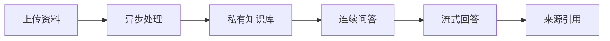

<div align="center">

# OrionaMesh

**面向个人与轻量团队的私有知识库 RAG 应用**

将 PDF、DOCX、Markdown 和纯文本资料处理为可检索知识库，并在连续问答中返回可核验的来源引用。

<p>
  
  <a href="LICENSE"></a>
</p>

<p>
  <a href="#本地开发">本地开发</a>
  ·
  <a href="#部署">部署</a>
  ·
  <a href="specs/001-orionamesh-rag-mvp/contracts/openapi.yaml">API 契约</a>
  ·
  <a href="specs/001-orionamesh-rag-mvp/quickstart.md">完整手册</a>
</p>

</div>

---

## 核心能力

- **可信问答**：回答通过 SSE 流式呈现；没有相关证据时明确说明，避免将推测伪装成知识库结论。
- **可追溯来源**：每条回答可查看按相关性排序的来源片段；资料删除后仅保留安全快照，不恢复原始资料。
- **私有隔离**：知识库、资料、对话和引用均由服务端按当前用户授权；问答只使用已完成处理的当前资料版本。
- **可靠处理**：资料经过 `parse → chunk → embed → finalize` 异步流水线，每个阶段与失败原因均可诊断。
- **受控模型出口**：Embedding、改写、重排和生成统一经过内部网关，执行脱敏、超时、重试和安全审计。

## 工作流



## 架构概览

| 层级   | 主要职责                           | 技术                                            |
| ------ | ---------------------------------- | ----------------------------------------------- |
| Web    | 认证、知识库、资料、会话与引用交互 | Next.js、TypeScript、TanStack Query             |
| API    | 版本化 REST/SSE、授权、业务编排    | FastAPI、SQLAlchemy、Alembic                    |
| Worker | 资料处理、重试和维护扫描           | Celery、Redis                                   |
| Data   | 关系数据、向量检索、持久化资料     | PostgreSQL 16 + pgvector/pg_trgm、Docker Volume |

## 本地开发

### 前置条件

- Python 3.12 与 [uv](https://docs.astral.sh/uv/)
- Node.js 22 LTS 与 pnpm（仓库根目录的 `pnpm-lock.yaml` 是唯一前端锁文件）
- PostgreSQL 16（启用 `pgvector`、`pg_trgm`）和 Redis 7
- 可用的 OpenAI-compatible 模型服务 endpoint 与凭证

### 1. 配置环境变量

```bash
git clone https://github.com/Cris-z123/oriona-mesh.git
cd oriona-mesh

cp backend/.env.local.example backend/.env.local
cp frontend/.env.example frontend/.env.local
```

填写 `backend/.env.local` 中的模型服务、JWT 密钥和限流 HMAC 密钥。不要提交任何 `.env.local`
文件或凭证。完整变量说明及本地代理规则见
[快速验证手册](specs/001-orionamesh-rag-mvp/quickstart.md#前置条件)。

### 2. 启动后端与 Worker

确保 PostgreSQL 和 Redis 已运行后，在两个终端分别执行：

```bash
cd backend
uv sync --locked
uv run alembic upgrade head
uv run orionamesh-api
```

```bash
cd backend
uv run celery -A app.workers.celery_app worker -B --loglevel=info
```

健康检查：

```bash
curl http://127.0.0.1:8000/health
```

### 3. 启动前端

```bash
# 在仓库根目录执行
pnpm install --frozen-lockfile
pnpm dev
```

打开 `http://localhost:3000`。开发服务器会将同源 `/v1/*` 代理到本地 API；无需为了本地开发放宽后端 CORS。

## 常用质量命令

```bash
# 前端：在仓库根目录执行
pnpm lint
pnpm format:check
pnpm typecheck
pnpm test

# 后端：在 backend/ 目录执行
uv run ruff format --check .
uv run ruff check .
uv run pyright
uv run pytest
```

CI 使用锁文件安装依赖，并执行静态检查、类型检查、测试、契约检查和镜像漏洞扫描。

完整的质量与交付门禁见[quickstart.md](specs/001-orionamesh-rag-mvp/quickstart.md#质量与交付验证)。

## 部署

单机部署使用 GitHub Release 提供的已校验镜像归档：服务器导入 backend/frontend 镜像，再由 Compose
启动 PostgreSQL、Redis、迁移、API、Worker、前端和 Nginx。服务器不构建应用镜像，也不依赖 GHCR。

首次部署、升级、回滚、镜像校验和安全组配置请严格遵循
[GitHub Release 单机部署手册](specs/001-orionamesh-rag-mvp/quickstart.md#github-release-单机部署腾讯云-ubuntu-x86_64)。

## 文档导航

| 文档                                                                   | 用途                             |
| ---------------------------------------------------------------------- | -------------------------------- |
| [开发指南](AGENTS.md)                                                  | 实施范围、文档权威边界和开发约束 |
| [产品规格](specs/001-orionamesh-rag-mvp/spec.md)                       | 用户故事、需求与验收标准         |
| [实施计划](specs/001-orionamesh-rag-mvp/plan.md)                       | 架构、模块边界和设计决策         |
| [API 契约](specs/001-orionamesh-rag-mvp/contracts/openapi.yaml)        | REST/SSE DTO、错误码与分页规则   |
| [模型出口契约](specs/001-orionamesh-rag-mvp/contracts/model-egress.md) | 脱敏、审计和供应商调用边界       |
| [快速验证手册](specs/001-orionamesh-rag-mvp/quickstart.md)             | 配置、验证、部署、升级与回滚     |
